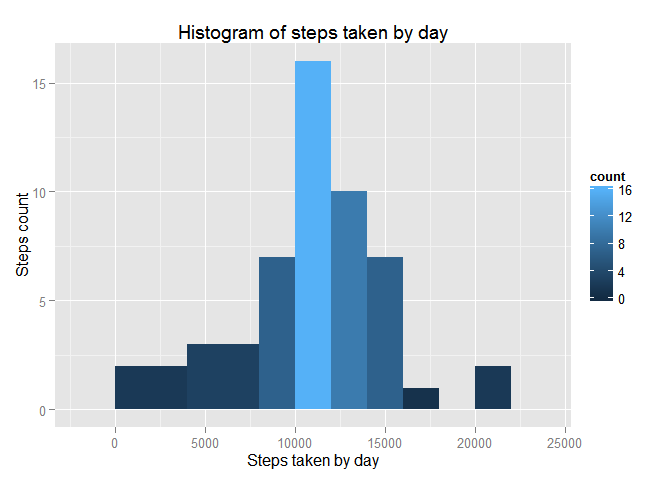
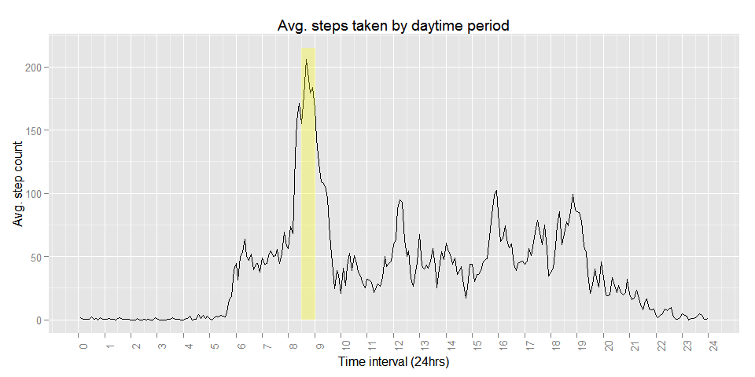
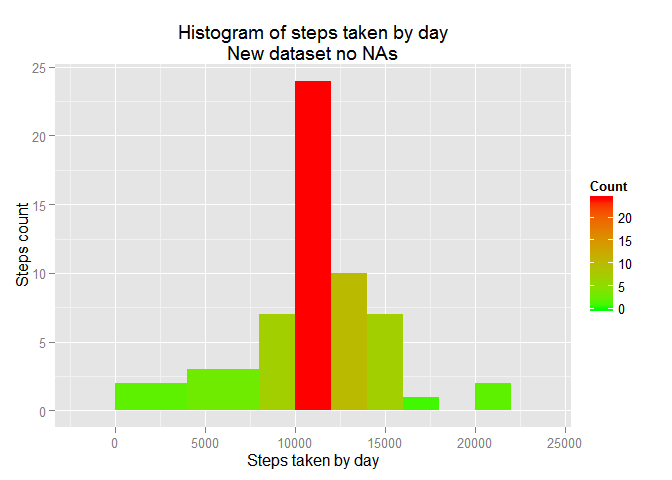
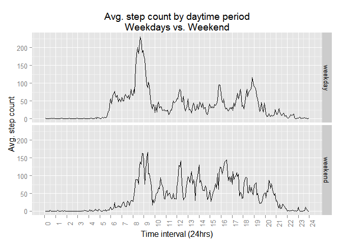

# Reproducible Research: Peer Assessment 1
Adolfo Hernandez  

###Requirements
This documents requires the ggplot2 package, please download it and load it in R before runing the code below.

```r
library(ggplot2)
```

```
## Warning: package 'ggplot2' was built under R version 3.1.1
```
## Loading and preprocessing the data
Please replace the file path below in the read.csv() function with the file path on your computer:

```r
active <- read.csv("C:\\Users\\Adolfo\\Documents\\Coursera\\The Data Science Specialization\\5. Reproducible Research\\activity.csv")
str(active)
```

```
## 'data.frame':	17568 obs. of  3 variables:
##  $ steps   : int  NA NA NA NA NA NA NA NA NA NA ...
##  $ date    : Factor w/ 61 levels "2012-10-01","2012-10-02",..: 1 1 1 1 1 1 1 1 1 1 ...
##  $ interval: int  0 5 10 15 20 25 30 35 40 45 ...
```

```r
summary(active)
```

```
##      steps                date          interval     
##  Min.   :  0.00   2012-10-01:  288   Min.   :   0.0  
##  1st Qu.:  0.00   2012-10-02:  288   1st Qu.: 588.8  
##  Median :  0.00   2012-10-03:  288   Median :1177.5  
##  Mean   : 37.38   2012-10-04:  288   Mean   :1177.5  
##  3rd Qu.: 12.00   2012-10-05:  288   3rd Qu.:1766.2  
##  Max.   :806.00   2012-10-06:  288   Max.   :2355.0  
##  NA's   :2304     (Other)   :15840
```
## What is mean total number of steps taken per day?
In order to know the total number of steps taken each day, first we need to rearrange our data to get the information we want:

```r
stepsbyday <- aggregate(steps ~ date, active, FUN = sum)
head(stepsbyday)
```

```
##         date steps
## 1 2012-10-02   126
## 2 2012-10-03 11352
## 3 2012-10-04 12116
## 4 2012-10-05 13294
## 5 2012-10-06 15420
## 6 2012-10-07 11015
```

```r
summary(stepsbyday)
```

```
##          date        steps      
##  2012-10-02: 1   Min.   :   41  
##  2012-10-03: 1   1st Qu.: 8841  
##  2012-10-04: 1   Median :10765  
##  2012-10-05: 1   Mean   :10766  
##  2012-10-06: 1   3rd Qu.:13294  
##  2012-10-07: 1   Max.   :21194  
##  (Other)   :47
```
The mean and the median are almost identical, this suggests that our variable distribution is fairly simmetrical and normal, we can confirm this with an histogram:

```r
m <- ggplot(stepsbyday, aes(x = steps))
m + geom_histogram(binwidth = 2000, aes(fill = ..count..)) +
    labs(title = "Histogram of steps taken by day", x = "Steps taken by day", y = "Steps count")  
```

 

In our mean and median calculation code above we didn't take into account the number of **NA** values in our dataset, mainly in our **steps** variable, just for future reference, the total count of missing **steps** values are:

```r
summary(active$steps)
```

```
##    Min. 1st Qu.  Median    Mean 3rd Qu.    Max.    NA's 
##    0.00    0.00    0.00   37.38   12.00  806.00    2304
```
Which means about that ``13.1`` percent of our data is missing.  

## What is the average daily activity pattern?
In order to get a better idea of the daily activity (steps taken) we graph a time series plot of the 5-minute interval and the average number of steps taken, averaged across all days, at this time ignoring the NA values:

```r
fivemin <- aggregate(steps ~ interval, active, FUN = mean)
head(fivemin)
```

```
##   interval     steps
## 1        0 1.7169811
## 2        5 0.3396226
## 3       10 0.1320755
## 4       15 0.1509434
## 5       20 0.0754717
## 6       25 2.0943396
```

```r
#xaxis <- rep(1:288, 2) #This variable is just for x-axis labeling purposes
xlabels <- as.character(seq(0, 24, 1)) #This variable is just for x-axis labeling purposes
q <- qplot(data = fivemin, x = 1:288, y = steps, geom = 'line')
q + scale_x_continuous(breaks = seq(0, 288, 12), labels = xlabels) + 
    theme(axis.text.x = element_text(angle = 90)) +
    labs(title = "Avg. steps taken by daytime period", x = "Time interval (24hrs)", y = "Avg. step count") + annotate("rect", xmin = 102, xmax = 108.5, ymin = 0, ymax = 215, alpha = .3, fill = "yellow")
```

 
The time period with highest activity was between **8:30 and 9:00am**, the exact interval was at **8:35am with 206 steps**:

```r
fivemin[fivemin$steps == max(fivemin$steps), ]
```

```
##     interval    steps
## 104      835 206.1698
```
## Imputing missing values
As we established before the total number of NA values is 2,304:

```r
sum(is.na(active))
```

```
## [1] 2304
```
In order to replace those missing values the mean value of each 5-min interval is going to be used accordingly in our dataset but first we preserve a copy of our original information then we replace all missing values:

```r
activefull <- active #A copy of our original dataset
activefull$steps <- sapply(1:length(active$steps),
                       function(i) ifelse(is.na(active$steps[i]),
                                          fivemin$steps[fivemin$interval == active[i,3]],
                                          active$steps[i]))
head(active) #Original dataset with missing NAs
```

```
##   steps       date interval
## 1    NA 2012-10-01        0
## 2    NA 2012-10-01        5
## 3    NA 2012-10-01       10
## 4    NA 2012-10-01       15
## 5    NA 2012-10-01       20
## 6    NA 2012-10-01       25
```

```r
sum(is.na(active))
```

```
## [1] 2304
```

```r
head(activefull) #New dataset with no NAs
```

```
##       steps       date interval
## 1 1.7169811 2012-10-01        0
## 2 0.3396226 2012-10-01        5
## 3 0.1320755 2012-10-01       10
## 4 0.1509434 2012-10-01       15
## 5 0.0754717 2012-10-01       20
## 6 2.0943396 2012-10-01       25
```

```r
sum(is.na(activefull))
```

```
## [1] 0
```
As we used the 5min intervals steps average for each missing value the mean and median in our new dataset will remain almost the same as our original dataset; we use the mean values so adding all these means won't change the overall distribution as we can see below:

```r
stepsbydayfull <- aggregate(steps ~ date, activefull, sum)
summary(stepsbydayfull)
```

```
##          date        steps      
##  2012-10-01: 1   Min.   :   41  
##  2012-10-02: 1   1st Qu.: 9819  
##  2012-10-03: 1   Median :10766  
##  2012-10-04: 1   Mean   :10766  
##  2012-10-05: 1   3rd Qu.:12811  
##  2012-10-06: 1   Max.   :21194  
##  (Other)   :55
```

```r
z <- ggplot(stepsbydayfull, aes(x = steps))
z + geom_histogram(binwidth = 2000, aes(fill = ..count..)) +
    labs(title = "Histogram of steps taken by day\nNew dataset no NAs", x = "Steps taken by day", y = "Steps count") + scale_fill_gradient("Count", low = "green", high = "red")
```

 

Dataset       | Mean
------------- | -------------
active (NAs)  | ``1.0766\times 10^{4}``
activefull (no NAs)   | ``1.0766\times 10^{4}`` 

## Are there differences in activity patterns between weekdays and weekends?
To determine if the same activity pattern remains through out the weekend first we have to do some arrangements to our new dataset:

```r
daynumber <- as.POSIXlt(as.Date(activefull$date))$wday #Week day number
activefull$weekday[daynumber > 0 & daynumber < 6] <- 'weekday'
activefull$weekday[daynumber == 0 | daynumber == 6] <- 'weekend'

avgperw <- aggregate(steps ~ interval + weekday, activefull, mean)
head(avgperw)
```

```
##   interval weekday      steps
## 1        0 weekday 2.25115304
## 2        5 weekday 0.44528302
## 3       10 weekday 0.17316562
## 4       15 weekday 0.19790356
## 5       20 weekday 0.09895178
## 6       25 weekday 1.59035639
```

```r
tail(avgperw)
```

```
##     interval weekday       steps
## 571     2330 weekend  1.38797170
## 572     2335 weekend 11.58726415
## 573     2340 weekend  6.28773585
## 574     2345 weekend  1.70518868
## 575     2350 weekend  0.02830189
## 576     2355 weekend  0.13443396
```
Now we can plot our data to compare weekdays vs. weekend:

```r
xaxis <- rep(1:288, 2)
xlabels <- as.character(seq(0, 24, 1))
p <- qplot(x = xaxis, y = steps, data = avgperw, geom = 'line',
           facets = weekday ~ .)
p + scale_x_continuous(breaks = seq(0, 288, 12), labels = xlabels) + 
    theme(axis.text.x = element_text(angle = 90)) +
    labs(title = "Avg. step count by daytime period\nWeekdays vs. Weekend", x = "Time interval (24hrs)", y = "Avg. step count")
```

 

Analyzing our weekdays vs. weekend plot we can notice the following:  
<ul>
<li>The 50 steps average mark is reached at almost 6am during weekdays vs. past 8am on weekends.</li>
<li>The biggest step count peak is 166 steps on weekends vs. 206 on weekdays.</li> 
<li>There are 4 different peaks (time periods) above 125 steps on weekends vs. just one on weekdays.</li>
<li>Activity seems to diminish around 8pm on weekdays vs. 9pm on weekends, below 50 steps count.</li>
</ul>
## Conclusion
Our study shows that there are different patterns of activity through out the day and during weekdays vs. weekends. Such differences could be due to the subject daily routines like exercise, work, errands, etc.
